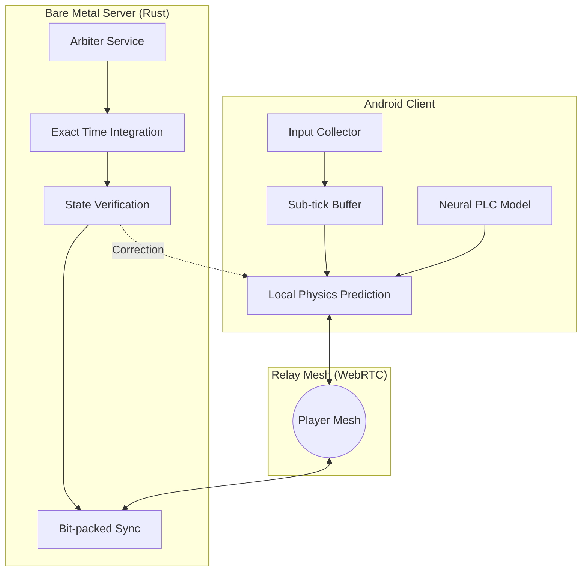

# Quantum-Pulse Netcode: Master Architectural Design

This document serves as the **Master Blueprint** for the Quantum-Pulse Netcode system (Level 10/10), consolidating strategy, internal structure, and execution logic.

---

## 1. High-Level System Architecture

The system follows a **Hybrid Server-Authoritative Mesh** design.

---

## 2. Competitive Benchmarks: Quantum-Pulse vs. Epic Iris

| Feature | Quantum-Pulse (10/10) | Iris (UE5 Standard) | Unreal Legacy |
|---------|-----------------------|---------------------|---------------|
| **Input Fidelity** | **Sub-tick Precision** | Tick-bound (Quantized)| Variable Tick |
| **Error Handling**| **Neural PLC (ML-driven)**| Standard Interpolation| Simple Snap |
| **Networking** | **Hybrid P2P Mesh** | Client-Server Only | Client-Server |
| **Data Transport**| **Bit-packed (Rust)** | Dynamic Filtering | Bit-streams |
| **Tick Model** | **Async Physics (60Hz+)**| Synchronous | Synchronous |
| **Optimization** | **NPU-offloaded PLC** | Efficient Replication | Basic RPC |

### Why Quantum-Pulse is the Choice for 2026 E-sports:
While **Iris** is a massive leap for Unreal Engine (optimizing actor replication for 100+ players), Quantum-Pulse addresses the "Last Mile" problems Iris ignores:
*   **Microsecond Precision**: Iris still quantizes inputs to the server tick. Quantum-Pulse uses **Sub-tick timestamps**, allowing the Rust arbiter to resolve events at the exact microsecond they occurred.
*   **Neural Recovery**: Iris relies on Jitter Buffers. When a packet is lost, you still "pop". Quantum-Pulse uses **Neural PLC** on the Android NPU to mask those gaps invisibly.
*   **Cost Sovereignty**: Iris is built for Cloud-Native scalability. Quantum-Pulse is built for **Bare Metal + P2P**, reducing bandwidth costs by up to 90%.

---

## 3. Technical Component Deep-Dive

### A. Sub-tick & QuantumTick Loop
Traditional fixed-tick systems (60Hz) result in a ~16.6ms input quantization error. Quantum-Pulse eliminates this.
*   **Packet Format**: Every input packet contains a `uint64` Microsecond Timestamp.
*   **Rust Solver**: The server doesn't just "apply" the input; it **integrates** the physics delta from the exact timestamp to the current server time using a variable-step Taylor series approximation.

### B. Hybrid P2P Mesh Logic
1.  **Handshake**: Server performs **Hardware Attestation** (StrongBox) on both clients.
2.  **STUN/TURN**: If NAT punch-through succeeds, a WebRTC Data Channel is opened.
3.  **Position Sync**: Raw position data is sent via P2P.
4.  **Verification**: Every 10th frame, clients hashes their state and sends it to the **Rust Arbiter**. If hashes drift, the server forces a **Chaos Resimulation** rewind.

### C. Neural PLC (Edge AI)
*   **Model**: Tiny-RNN (Recurrent Neural Network).
*   **Inference**: Offloaded to Android **NPU** via OpenCL or Vulkan.
*   **Input**: Last 5 valid state vectors (Position, Velocity, Acceleration).
*   **Output**: Predicted next state for up to 300ms of packet loss.

---

## 3. Data Compression (Bit-packing)

We avoid standard JSON/Protobuf for hot-path networking.

| Field | Range | Bits | Precision |
|-------|-------|------|-----------|
| **Velocity.X** | -2048 to 2047 | 12 | 1.0 units |
| **Rotation.Yaw**| 0 to 360 | 9 | 0.7 degrees|
| **Input Mask** | 8 actions | 8 | Binary |
| **Timestamp** | Relative | 10 | 1ms |

**Total Payload**: ~40-60 bits per object (vs 256+ bits in standard systems).

---

## 4. Deployment & Scalability

### Bare Metal Deployment
*   **Platform**: Linux (Ubuntu 24.04).
*   **Containerization**: Docker with `--net=host` to avoid NAT overhead.
*   **Orchestration**: **Agones** custom resource definition (CRD) to handle game-server lifecycle.

### CI/CD Pipeline
1.  **Commit**: Code push to GitLab/GitHub.
2.  **Build**: Multi-stage Docker build (Rust binaries + UE5 Headless).
3.  **Test**: Run `NetcodeTests` (Linux).
4.  **Deploy**: Push image to Private Registry and trigger Agones rollout.

---

## 5. Security & Anti-Cheat Layer
*   **Memory Integrity**: Managed by Rust's ownership model on the server.
*   **Client Integrity**: **Android StrongBox** signatures on every significant RPC.
*   **Heuristics**: Server-side AI to detect "Unnatural Acceleration" by comparing Sub-tick timestamps with physics limits.

---

## 6. PvE Strategy: 1,000+ AI Entities on Android

In a PvE context, the challenge shifts from "Latency Competition" to **"Entity Density"** and **"Server Computational Efficiency"**.

### A. High-Density AI with Flecs (ECS)
*   **Rust + Flecs**: Moving AI logic (Behavior Trees/Utility AI) to the Rust domain allows us to simulate thousands of NPCs with minimal CPU overhead.
*   **Massive Batching**: We use **Iris-like spatial filtering** on the Rust side to only send NPC data that is relevant to the player's proximity.

### B. Distributed Authority for Minions
*   **Design**: Bosses/Elites remain **Server-Authoritative**. However, for hundreds of "Minions", we use **Client-Side Simulation with Server Verification (CSSV)**.
*   **P2P AI Sync**: If players are clustered, one player acts as the "Simulation Proxy" for local minions, sending positions to others via P2P Mesh to save server egress. The server only validates "Damage" and "Death" events.

### C. Neural PLC for NPC Smoothness
*   **Problem**: In high-density PvE, server ticks for distant AI might be throttled (Area of Interest - AoI).
*   **Solution**: **Neural PLC** on the client fills in the gaps for throttled NPCs, making them appear to move at 120fps even if the server only updates their position at 10Hz.

---

> [!TIP]
> **PvE Scaling**: By offloading minion movement to the P2P Mesh and using Rust/Flecs for high-density AI logic, we can support "Horde-style" gameplay on mobile without causing server-side bottlenecks or high data costs.

---

## 7. Server Resource & Physics Footprint

To achieve **Server-Side Authority**, the Dedicated Server must simulate the physical world.

### A. Headless Chaos Physics
*   **Role**: The server runs **Chaos Physics** without a GPU (Headless). It uses the CPU to calculate collisions, triggers, and character movement constraints.
*   **Optimization**: We strip all "Engine Graphical" data (Textures, Shaders, UI) from the server build, keeping only **Collision Meshes** (PhysX/Chaos geometry).

### B. Build & Storage Size Estimates
| Item | Estimated Size | Optimization |
|------|----------------|--------------|
| **Linux Binary** | 250MB - 450MB | Stripped rendering/audio modules |
| **Collision Assets**| 100MB - 300MB | Low-poly collision geometry only |
| **Docker Image** | 650MB - 900MB | Using `debian-slim` or `alpine` base |
| **RAM Usage** | ~1.5GB - 3GB | Varies by player count and AI density|

---

> [!NOTE]
> **Server Efficiency**: By offloading heavy math to **Rust** and using **Flecs** for AI logic, the Unreal side of the server is primarily reduced to a **"Collision Validator"**, allowing for much higher player density per vCPU than standard Unreal servers.

---

> [!IMPORTANT]
> This master design is the **Technical Source of Truth**. Any changes to individual modules (FFI, Shaders, or Tests) must be reflected here to maintain systemic coherence.
